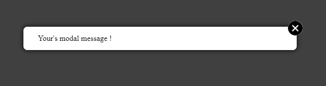

# simply-modale is a library of React components 

it's a basic modal with a close button to close it, it can also disappear with the keyboard key "escape".
it is a maximum width of 500px and it is responsive.

## Installation

Run the following command:`npm install simply-modale`

## How to use

### Import

Just import the Modal component in the file you want to use the modal with and set its children for the content of your modal

`import { Modal } from simply-modale`

### Model

   ```
   {modalIsOpen && (
    <Modal
	    closeModal={closeModal}
    >
	    <p>Your modal's message !</p>	      
    </Modal>
)}
```

### State

The modal functionality is handled by the local state of the modal's parent. Therefore, the parent component requires state. I have used `modaleIsOpen` and `setModaleIsOpen` as variable names, but you can call them whatever you like.


`` const [modalIsOpen, setModalIsOpen] = useState(false)``


The initial state should be set to __false__.

An action at the parent component's level allows to change the state to __true__.

```
const  validation = () => {
    setModalIsOpen(true)
}

```

The "closeModal" prop receives the "closeModal" function as its value. This allows the modal to be closed on a button click.

``
 const  closeModal = () => {
    setModalIsOpen(false)
 }
``
